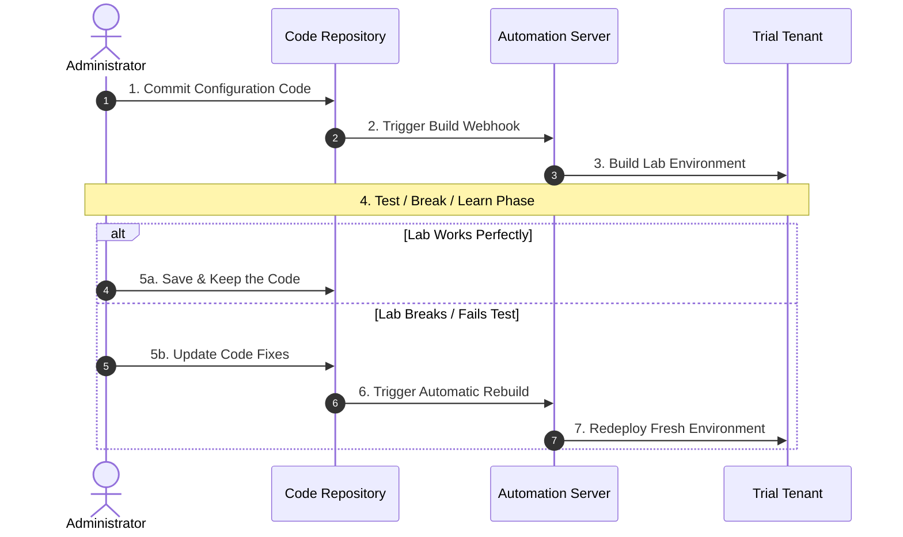
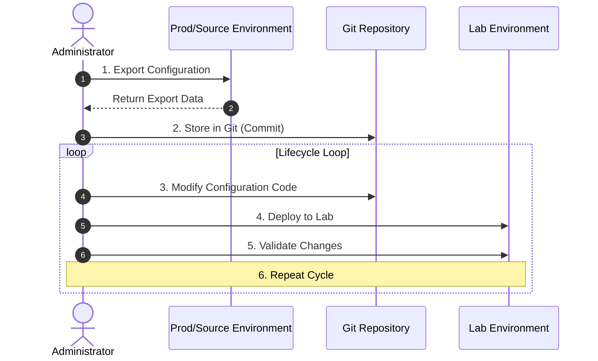
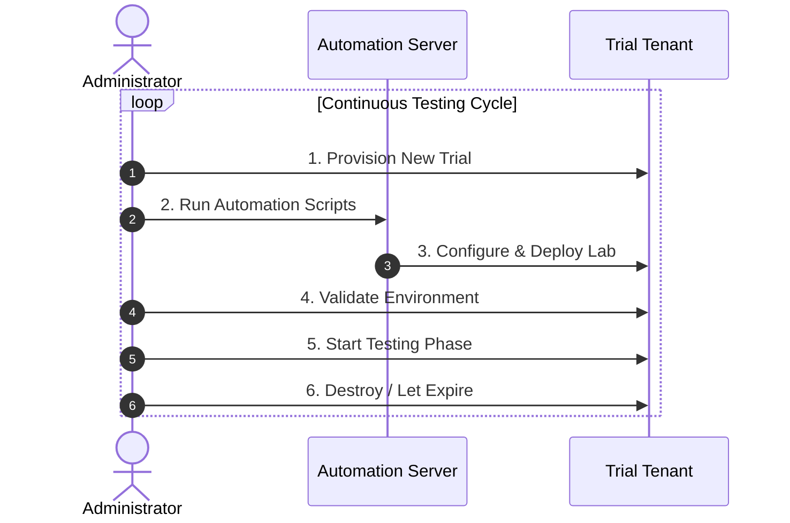

### Introduction

If you have ever stared at a PowerShell script and thought, "This looks right... but what if it deletes the wrong thing in production?", you are not alone.

That anxiety is real, especially with scripts that make changes at scale. A script like [Automate Device Cleanup in Microsoft Intune with PowerShell]() is powerful, but running it first in a live environment is not a strategy. It is a risk.

Modern operations needs a safe space to fail.

A lab tenant gives you exactly that: a place to test, break, learn, and refine before anything touches production.

But there is a problem.

I don't have a Visual Studio Enterprise or Professional subscription, so I don't have access to the type of Microsoft 365 developer environment that is often recommended when building an Intune lab.

So instead of trying to maintain a permanent lab, I'm taking a different approach:

**Make the lab disposable.**

### The Solution: A Disposable Intune Lab

Microsoft provides a free 30-day Intune trial that creates a new Microsoft Entra tenant and includes Microsoft Intune. The trial is designed for evaluating Intune, which makes it a great starting point for a personal learning and development environment.

You can sign up directly through Microsoft's [Microsoft Intune free trial](https://learn.microsoft.com/en-us/intune/fundamentals/free-trial-sign-up).

The important part is that I'm not treating the tenant as something I need to keep forever.

I'm treating it as infrastructure.


The tenant is disposable.

The automation is not.

### Why Disposable?

At first, the idea of rebuilding your Intune environment every time the trial expires sounds like a lot of work.

And if you were doing everything manually, it would be.

Creating users, groups, policies, configuration profiles, applications and enrollment settings through the portal isn't something I want to repeat over and over.

But that's exactly where automation becomes useful.

If I can reduce the process from:

> "Spend an afternoon rebuilding my lab"

to:

> "Run my setup scripts and wait"

then the 30-day lifespan becomes much less important.

In fact, there is an argument that a disposable lab is better than a permanent one.

A permanent lab accumulates configuration.

A disposable lab can start clean.

That makes it much easier to test the automation that creates the environment in the first place.

### Step 1: Create the Intune Trial

The first step is straightforward.

Go to Microsoft's [Intune free trial signup](https://learn.microsoft.com/en-us/intune/fundamentals/free-trial-sign-up) and create the trial environment.

> **Note**: Microsoft's current process creates a new tenant for the trial and provides an Enterprise Mobility + Security subscription that includes Intune and Microsoft Entra ID.
{: .prompt-tip }

The trial is currently available for 30 days.

During signup, Microsoft asks for information such as:

* Name
* Phone number
* Organization information
* Region
* A tenant name
* A payment method for verification

The payment method is used for verification and isn't charged unless you purchase something.

Once the tenant has been created, sign in to the [Microsoft Intune admin center](https://intune.microsoft.com).

The account that creates the subscription starts with the Global Administrator role.

For a lab, that's fine initially. But even in a throwaway environment, I prefer to create separate accounts for administration and testing.

The goal is to make the lab behave like a real environment.

### Step 2: Don't Build the Lab Manually

This is where my approach differs from a traditional Intune trial walkthrough.

I'm not interested in spending an hour clicking through the portal just to get to the point where I can start testing PowerShell.

Instead, I want the portal to get me to the starting line.

Everything after that should be automated where possible.

My lab needs a few basic components:

* An administrative account
* One or more test users
* Test groups
* Intune licensing
* Windows enrollment configuration
* Configuration profiles
* Compliance policies
* Application deployments
* Test devices
* Microsoft Graph access

The exact configuration will change as I use the lab, but the important part is that the configuration lives in code.

### Step 3: Establish a Naming Convention

When working with a disposable tenant, naming becomes especially important.

I use obvious prefixes for lab resources:

```text
LAB-Users
LAB-Devices
LAB-Pilot
LAB-Applications
LAB-Configuration
LAB-Compliance
```

This makes it immediately obvious that I'm working with lab resources.

It also makes automation easier.

For example, if a script needs to find the group used for testing application deployments, I don't want to depend on an automatically generated object ID.

I want the script to be able to find:

```text
LAB-Applications
```

and work from there.

Object IDs will change every time the tenant is rebuilt.

Names don't have to.

### Step 4: Connect PowerShell to Microsoft Graph

This is where the lab starts becoming useful for me.

My goal isn't simply to learn where things are in the Intune portal.

I want to be able to manage Intune programmatically.

If you need a refresher, see [Getting Started with PowerShell for Intune - Connecting to Intune]().

A basic connection looks something like this:

```powershell
Import-Module Microsoft.Graph

Connect-MgGraph -Scopes `
    "DeviceManagementManagedDevices.ReadWrite.All",
    "DeviceManagementConfiguration.ReadWrite.All"

Get-MgContext
```

From here, the lab becomes a safe place to experiment with Microsoft Graph.

Create something.

Change something.

Delete something.

Break something.

Then figure out how to automate it.

### Step 5: Make the Build Idempotent

This is probably the most important part of the entire lab.

I don't want a collection of scripts that only work when the tenant looks exactly the way I expect.

I want the scripts to be **idempotent**.

In other words, if the resource already exists, the script should recognize it rather than blindly creating another one.

For example:

```powershell
$groupName = "LAB-Pilot"

$group = Get-MgGroup -Filter "displayName eq '$groupName'"

if (-not $group) {
    $group = New-MgGroup `
        -DisplayName $groupName `
        -MailEnabled:$false `
        -MailNickname "lab-pilot" `
        -SecurityEnabled:$true
}
```

The exact implementation will depend on what I'm building, but the principle is the same:

**The script should describe the desired state rather than assume the starting state.**

That makes the automation useful beyond this lab.

It's the same mindset I want when building production automation.

### Step 6: Build the Lab in Layers

I don't want one giant script that does everything.

Instead, I prefer to build the environment in logical layers.

```text
01 - Tenant / Authentication
02 - Users and Groups
03 - Licensing
04 - Enrollment
05 - Configuration Profiles
06 - Compliance
07 - Applications
08 - Test Device Configuration
09 - Validation
```

This makes troubleshooting much easier.

If the application deployment fails, I shouldn't have to rebuild the entire tenant to figure out why.

I can run the application portion independently.

It also means I can add new components to the lab without rewriting everything that came before it.

### Step 7: Enroll a Test Windows 11 Device

A Windows 11 virtual machine gives me a disposable endpoint to go along with my disposable tenant.

I can use Hyper-V, VMware, VirtualBox, or another virtualization platform to create a clean Windows 11 VM.

The basic flow is:

1. Build a clean Windows 11 VM.
2. Sign in using a dedicated lab user.
3. Enroll the device into Intune.
4. Confirm the device appears in the Intune admin center.
5. Apply policies and applications.
6. Test.
7. Break it.
8. Reset the VM when necessary.

The important thing here is that **the endpoint is disposable too**.

I don't want my production workstation becoming part of the experiment.

### Step 8: Test Everything You Wouldn't Dare Test in Production

This is where the lab earns its keep.

Want to see what happens when you deploy a configuration profile incorrectly?

Try it.

Want to test a PowerShell remediation?

Try it.

Want to see whether your Graph query returns the devices you think it will?

Try it.

Want to test an Intune cleanup script?

Absolutely try it.

That's the point.

For example, [Automate Device Cleanup in Microsoft Intune with PowerShell]() is exactly the kind of script I want to test against a lab before trusting it against a production tenant.

A disposable environment gives me somewhere to answer questions like:

* Did I filter the correct devices?
* What happens if the API returns no results?
* What happens if an object is already deleted?
* What happens if the script runs twice?
* What permissions does the script actually need?
* What happens when something goes wrong?

Those are much better questions to answer in a lab than in production.

### Step 9: Keep the Configuration, Not the Tenant

This is the mindset shift that makes the whole approach work.

I don't need to preserve the tenant.

I need to preserve the **recipe for creating the tenant's configuration**.

That means keeping things like:

* PowerShell scripts
* Graph API calls
* JSON configuration
* Configuration profile definitions
* Compliance policy definitions
* Application deployment configuration
* Naming conventions
* Documentation
* Test scripts

The tenant itself can disappear.

The code remains in source control.

When I need another environment, I rebuild it.

### Configuration Profile Version Control

This approach also fits nicely with the idea of managing Intune configuration as code.  Rather than manually recreating a configuration profile every time, I can store the configuration and use automation to deploy it.  That's where [Configuration Profile Version Control]() becomes useful.

The lab gives me somewhere to test the process:



Now the lab isn't just an Intune playground.  It's also a development environment for my Intune automation.

### Infrastructure as Code

The same concept applies to [Infrastructure as Code (IaC) for Intune: Moving Beyond Manual Management]().

A disposable tenant gives me somewhere to test the idea that an Intune environment can be described and recreated from code.

If my automation can take an empty tenant and turn it into a functioning lab, I've learned something much more valuable than where a particular setting lives in the Intune portal.

I've learned how to reproduce the configuration.  That's the real goal.

### Lab Operating Best Practices

Even though this is a disposable environment, I still treat it like real infrastructure.

A few rules I follow:

1. Keep production and lab credentials completely separate.
2. Use clear `LAB-` or `TEST-` naming conventions.
3. Never put real production data into the lab.
4. Keep automation in source control.
5. Avoid hard-coding tenant-specific object IDs.
6. Make scripts safe to run more than once.
7. Document anything that can't be automated.
8. Keep the Windows test device disposable.
9. Export anything important before the tenant disappears.
10. Assume the tenant will eventually be deleted.

That last one is important.

If something only exists inside the tenant and isn't represented somewhere in source control, I don't consider it part of my lab automation.

### What Happens When the Trial Ends?

Eventually, the trial ends.

And that's okay.

I'm not building a permanent production environment.

I'm building a development environment.

If I need another lab, I'll create another trial tenant and run the automation again.

That's actually a useful test of the automation.

If rebuilding the lab is painful, my automation isn't finished yet.

The goal is to keep reducing the amount of manual work required.



### Conclusion

I originally approached the idea of an Intune lab thinking I needed a permanent tenant.

I don't.

What I really need is a **repeatable environment**.

The 30-day Intune trial gives me the tenant.

PowerShell and Microsoft Graph give me the automation.

A Windows 11 VM gives me a disposable endpoint.

Git gives me a place to keep the configuration.

Put those pieces together and I have something much more useful than a permanent sandbox:

**I have a lab I can rebuild.**

And that changes the way I experiment.

I'm no longer worried about breaking the tenant.

I'm worried about making the rebuild process better.

That's a much more interesting problem to solve.

So yes, break things in the lab.

Then delete the lab.

Then build it again.

That's how you build stronger scripts, cleaner policies, and more reliable automation before it ever gets near production.

### References

* [Getting Started with PowerShell for Intune - Connecting to Intune]()
* [Automate Device Cleanup in Microsoft Intune with PowerShell]()
* [Configuration Profile Version Control]()
* [Infrastructure as Code (IaC) for Intune: Moving Beyond Manual Management]()
* [Microsoft Intune Free Trial](https://learn.microsoft.com/en-us/intune/fundamentals/free-trial-sign-up)
* [Microsoft Intune Documentation](https://learn.microsoft.com/en-us/intune/)


